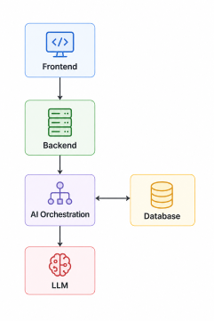

# Tài Liệu Kiến Trúc Hệ Thống SmartForm

---
## 1. Sơ Đồ Kiến Trúc Tổng Quan

Hệ thống được thiết kế theo mô hình phân tầng chuyên biệt (Layered Architecture) gồm 5 lớp chính nhằm đảm bảo tính mở rộng (scalability), khả năng bảo mật và tối ưu hóa chi phí khi vận hành các mô hình ngôn ngữ lớn (LLM).

---

## 2. Chi Tiết Chức Năng Và Vai Trò Các Thành Phần

### A. [ TẦNG GIAO DIỆN - FRONTEND ]
* **Vai trò:** Là lớp tiếp xúc trực tiếp với người dùng cuối (End-user), chịu trách nhiệm về mặt trải nghiệm (UX) và giao diện (UI).
* **Chức năng chính:**
  * Hiển thị các biểu mẫu (Forms) động và khu vực tương tác với AI.
  * Thu thập dữ liệu đầu vào (Input) từ người dùng và gửi xuống tầng Backend.
  * Tiếp nhận luồng dữ liệu trả về liên tục (Streaming Data) để hiển thị kết quả theo thời gian thực (AI gõ chữ đến đâu hiển thị đến đó).
* **Công nghệ sử dụng:** `React` / `Vue.js`, `Tailwind CSS` (tối ưu UI/UX), `WebSockets (WSS)` / `Server-Sent Events (SSE)` (xử lý streaming).

### B. [ TẦNG ĐIỀU PHỐI & NGHIỆP VỤ - BACKEND ]
* **Vai trò:** Đóng vai trò là "bộ não điều hành" các nghiệp vụ truyền thống của toàn bộ hệ thống phần mềm.
* **Chức năng chính:**
  * **API Gateway:** Tiếp nhận mọi yêu cầu từ Frontend, chịu trách nhiệm xác thực người dùng (Authentication), phân quyền (Authorization) và kiểm soát lưu lượng (Rate Limiting) để bảo vệ hệ thống khỏi bị quá tải hoặc lạm dụng API AI gây tốn chi phí.
  * **Core Service:** Xử lý các logic nghiệp vụ lõi (quản lý tài khoản, lưu trữ cấu hình form, phân tích luồng đi của dữ liệu) và điều phối công việc: quyết định khi nào cần gọi tầng AI, khi nào cần thao tác với cơ sở dữ liệu.
* **Công nghệ sử dụng:** `FastAPI` (Python) hoặc `NestJS` (TypeScript), `Kong API Gateway` / `AWS API Gateway`.

### C. [ TẦNG AI ORCHESTRATION ] (Điều Phối AI)
* **Vai trò:** Là tầng trung gian chuyên biệt đảm nhận việc quản lý, tối ưu hóa và dẫn dắt các tiến trình xử lý của Trí tuệ nhân tạo.
* **Chức năng chính:**
  * **Kỹ nghệ Prompt (Prompt Engineering):** Nhận yêu cầu từ Backend và chuyển cấu trúc câu lệnh thành dạng Prompts tiêu chuẩn mà LLM có thể hiểu tốt nhất.
  * **Quản lý ngữ cảnh và bộ nhớ (Memory Management):** Lưu trữ và duy trì ngữ cảnh của cuộc hội thoại (lịch sử chat/nhập liệu trước đó).
  * **Xây dựng AI Agent:** Thiết lập các chuỗi tư duy (Chains) hoặc tác nhân tự trị (Agents) để xử lý các tác vụ phức tạp cần qua nhiều bước suy luận.
* **Công nghệ sử dụng:** `LangChain`, `LlamaIndex`, `LangGraph` (xử lý Agentic AI), `Redis` (lưu bộ nhớ đệm hội thoại).

### D. [ LỚP MÔ HÌNH LLM ] (Large Language Models)
* **Vai trò:** Là hạt nhân cung cấp năng lực trí tuệ nhân tạo (suy luận, đọc hiểu, phân tích, thế kế) cho toàn hệ thống.
* **Chức năng chính:**
  * Tiếp nhận các Prompts đã được chuẩn hóa và giàu ngữ cảnh từ tầng Orchestration.
  * Thực hiện suy luận và sinh nội dung.
  * Ép buộc định dạng đầu ra thành **Dữ liệu có cấu trúc (Structured Output - JSON)** thay vì văn bản tự do, giúp hệ thống lập trình đọc hiểu kết quả một cách chính xác tuyệt đối mà không bị lỗi cấu trúc.
* **Công nghệ sử dụng:** `Gemini API` (Google), `GPT-4o` (OpenAI), hoặc các mô hình mã nguồn mở như `Llama 3` chạy nội bộ qua `Ollama` / `vLLM`.

### E. [ TẦNG LƯU TRỮ - DATABASE ]
* **Vai trò:** Nơi lưu trữ vĩnh viễn toàn bộ tài nguyên, dữ liệu hệ thống và cơ sở tri thức phục vụ AI.
* **Chức năng chính:**
  * Lưu trữ dữ liệu quan hệ truyền thống (Thông tin User, logs, biểu mẫu).
  * Lưu trữ dữ liệu dạng Vector (Vector Embeddings) – đóng vai trò là "kho tri thức" nền tảng để AI có thể tra cứu và đọc hiểu trước khi đưa ra câu trả lời (Quy trình RAG).
* **Công nghệ sử dụng:** `PostgreSQL` (kèm extension `pgvector`) hoặc kết hợp `MySQL` với các Vector DB chuyên dụng như `Qdrant`, `Pinecone`, `Milvus`.

---

## 3. Bản Chất Và Chức Năng Của Các Luồng Mũi Tên (Luồng Dữ Liệu)

Cách các thành phần giao tiếp với nhau được thể hiện qua các hướng mũi tên trong sơ đồ:

### 1. Frontend ↔ Backend
* **Ý nghĩa tổng quan:** Đây là luồng giao tiếp trực tiếp giữa người dùng và hệ thống quản trị, sử dụng giao thức truyền thông mạng chuẩn hóa để tối ưu hóa trải nghiệm thời gian thực.
* **Chi tiết luồng hai chiều:**
  * **Chiều xuống (Frontend → Backend - Request):** Frontend gửi các yêu cầu tương tác, dữ liệu đăng nhập hoặc nội dung biểu mẫu do người dùng vừa nhập xuống Backend thông qua giao thức `HTTPS` hoặc `REST API`.
  * **Chiều lên (Backend → Frontend - Response):** Backend truyền ngược dữ liệu kết quả về cho Frontend thông qua giao thức `WebSockets (WSS)` hoặc cơ chế `JSON Streaming`. Giúp hiển thị nội dung chạy ra liên tục theo thời gian thực (giống như AI đang gõ chữ).

### 2. Backend → AI Orchestration
* **Ý nghĩa tổng quan:** Thể hiện hành động kích hoạt tiến trình thông minh của hệ thống từ luồng nghiệp vụ thông thường sang luồng xử lý AI.
* **Chi tiết luồng:**
  * **Chiều xuống (Backend → AI Orchestration - Trigger):** Core Service sau khi hoàn tất kiểm tra nghiệp vụ và phân quyền, tiến hành phát lệnh (trigger) và chuyển giao toàn bộ dữ liệu thô (Raw Data) cùng yêu cầu người dùng sang cho tầng điều phối AI.

### 3. AI Orchestration ↔ Lớp Mô Hình LLM
* **Ý nghĩa tổng quan:** Đây là luồng tích hợp mô hình ngôn ngữ lớn (LLM Integration), kết nối trí tuệ nhân tạo gốc với hệ thống quản lý ứng dụng.
* **Chi tiết luồng hai chiều:**
  * **Chiều xuống (AI Orchestration → Lớp Mô hình LLM - API Call):** Tầng Orchestration thực hiện các lệnh gọi API (`API Calls`) gửi hệ thống các câu lệnh (`Prompts`) đã được tinh chỉnh, bổ sung đầy đủ ngữ cảnh bộ nhớ sang cho các mô hình AI (Gemini, GPT-4o).
  * **Chiều lên (Lớp Mô hình LLM → AI Orchestration - Return JSON):** Các mô hình LLM sau khi suy luận xong sẽ trả kết quả phân tích về. Kết quả này bắt buộc phải ép về dạng cấu trúc định sẵn (`Structured Output - JSON`) để hệ thống bóc tách tự động mà không bị lỗi.

### 4. Backend ↔ Database
* **Ý nghĩa tổng quan:** Đây là luồng tương tác cơ sở dữ liệu nghiệp vụ truyền thống (**OLTP - Online Transaction Processing**), đảm bảo tính nhất quán và toàn vẹn dữ liệu (ACID) của hệ thống.
* **Chi tiết luồng hai chiều:**
  * **Chiều xuống (Backend → Database - Write/Query):** Core Service gửi các câu lệnh (SQL Queries hoặc NoSQL Commands) để thực hiện các thao tác:
    * **Ghi dữ liệu (Write):** Lưu thông tin tài khoản mới, lưu lịch sử submit biểu mẫu của người dùng, tạo log hệ thống.
    * **Cập nhật (Update):** Thay đổi trạng thái xử lý của form, cập nhật phân quyền (Roles).
  * **Chiều lên (Database → Backend - Result Set):** Cơ sở dữ liệu xử lý yêu cầu và trả về kết quả cho Core Service:
    * **Trả dữ liệu (Read Result):** Trả về thông tin cấu hình form, danh sách biểu mẫu cũ, thông tin xác thực tài khoản (để khớp mật khẩu/token).
    * **Trạng thái (Status):** Trả về thông báo thao tác Ghi/Cập nhật thành công hoặc thất bại.

### 5. AI Orchestration → Database
* **Ý nghĩa tổng quan:** Đây là luồng truy xuất dữ liệu phục vụ riêng cho các tác vụ Trí tuệ nhân tạo (Cơ chế **RAG - Retrieval-Augmented Generation**).
* **Chi tiết luồng:**
  * **Chiều qua (AI Orchestration → Database - Content Archival):** Chuyển các dữ liệu đặc thù của AI về lưu trữ trong Database như: lưu lịch sử hội thoại (`Chat Message History`), lưu bộ nhớ đệm (`Prompt Cache`), hoặc lưu trạng thái các bước xử lý của AI Agent (`Agent State`).