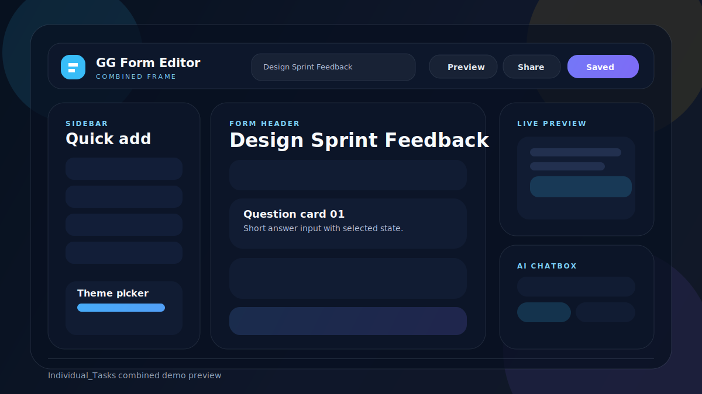

# GG Form - Individual Tasks

`Individual_Tasks` là bản chia nhỏ giao diện GG Form thành 5 phần việc độc lập, kèm một folder `demo` là khung ghép hoàn chỉnh để trình bày nhanh trên GitHub.



## Mục tiêu

- Chia rõ trách nhiệm cho từng người.
- Mỗi folder có thể mở và chạy độc lập.
- Có một trang `demo` mô phỏng khung giao diện sau khi ghép 5 phần lại với nhau.

## Kiến trúc

Dự án được tổ chức theo hướng chia nhỏ giao diện thành các module độc lập. Mỗi thành viên phụ trách một khu vực chức năng riêng như layout, form editor, sidebar, preview, share modal hoặc AI chatbox. Cách chia này giúp từng phần có thể phát triển, kiểm thử và chỉnh sửa riêng trước khi ghép vào bản demo tổng thể.

Kiến trúc chính gồm ba lớp:

- **HTML**: xây dựng cấu trúc nội dung cho từng vùng giao diện, ví dụ top bar, form header, question card, sidebar, modal và chatbox.
- **CSS**: định nghĩa bố cục, màu sắc, khoảng cách, trạng thái hover/focus, responsive và phong cách hiển thị thống nhất giữa các phần.
- **JavaScript**: xử lý các tương tác cơ bản như thêm câu hỏi, sao chép, xóa, mở modal, đổi theme, preview form và hiển thị thông báo.

Folder `demo` đóng vai trò là bản tích hợp, mô phỏng cách các phần riêng lẻ hoạt động cùng nhau trong một màn hình chỉnh sửa biểu mẫu hoàn chỉnh. Các folder `Person_*` vẫn giữ tính độc lập để dễ phân công, trình bày và bảo trì.

## Giao diện

Giao diện được thiết kế theo phong cách trình chỉnh sửa biểu mẫu hiện đại, lấy cảm hứng từ Google Forms nhưng được chia thành các khối rõ ràng để dễ thao tác. Màn hình chính tập trung vào vùng soạn form, nơi người dùng có thể nhập tiêu đề, mô tả, tạo câu hỏi và chọn kiểu trả lời.

Các thành phần giao diện chính gồm:

- **Top bar**: hiển thị tên form, trạng thái lưu và các nút hành động nhanh.
- **Form header**: cho phép nhập tiêu đề và mô tả biểu mẫu.
- **Question card**: trình bày từng câu hỏi dưới dạng thẻ, có vùng nhập nội dung, kiểu câu hỏi, lựa chọn trả lời, trạng thái bắt buộc và các nút thao tác.
- **Sidebar và theme picker**: hỗ trợ thêm thành phần mới, đổi màu/chủ đề và xem trước phong cách form.
- **Preview và share modal**: giúp xem biểu mẫu ở chế độ người trả lời và chia sẻ bằng link hoặc embed.
- **AI chatbox**: hỗ trợ gợi ý nội dung, tạo câu hỏi nhanh và cải thiện trải nghiệm sử dụng.

Tổng thể giao diện ưu tiên sự rõ ràng, dễ quét thông tin và thao tác nhanh. Các vùng chức năng được tách bằng khoảng trắng, thẻ nội dung và màu nhấn nhẹ để người dùng dễ nhận biết phần đang chỉnh sửa.

## Cấu trúc thư mục

```text
Individual_Tasks/
├── assets/
│   └── demo-preview.svg
├── demo/
│   ├── index.html
│   ├── style.css
│   ├── script.js
│   ├── README.md
│   └── open_demo.ps1
├── Person_1_Layout_TopBar/
├── Person_2_FormHeader_QuestionCard/
├── Person_3_Sidebar_ThemePicker/
├── Person_4_ShareModal_Preview/
└── Person_5_ChatBox_Responsive/
```

## Demo

Mở [folder demo](demo/index.html) để xem bản trình bày gọn, đẹp và dễ đưa lên GitHub.

Trong demo có:

- Top bar, sidebar, form header, question cards, preview/share và AI chatbox trong cùng một màn hình.
- Các khu vực thể hiện đúng vai trò của từng task sau khi combine.
- Hướng dẫn chạy local và lệnh đẩy repo lên GitHub.

## Các phần việc

### 1. Layout & Top Bar

- File: [Person_1_Layout_TopBar/README.md](Person_1_Layout_TopBar/README.md)
- Vai trò: xương sống của editor, top bar, trạng thái lưu, các nút hành động.

### 2. Form Header & Question Card

- File: [Person_2_FormHeader_QuestionCard/README.md](Person_2_FormHeader_QuestionCard/README.md)
- Vai trò: header form, question cards, thao tác copy/delete/add.

### 3. Sidebar & Theme Picker

- File: [Person_3_Sidebar_ThemePicker/README.md](Person_3_Sidebar_ThemePicker/README.md)
- Vai trò: sidebar thêm câu hỏi nhanh, chọn theme, preview theme.

### 4. Share Modal & Preview

- File: [Person_4_ShareModal_Preview/README.md](Person_4_ShareModal_Preview/README.md)
- Vai trò: preview mode, share modal, copy link/embed, confirmation.

### 5. AI Chatbox & Responsive

- File: [Person_5_ChatBox_Responsive/README.md](Person_5_ChatBox_Responsive/README.md)
- Vai trò: AI chatbox floating, quick actions, toast, responsive polish.

## Cách chạy demo

### Cách 1: Mở trực tiếp

1. Vào folder `Individual_Tasks/demo`.
2. Mở `index.html` bằng trình duyệt.

### Cách 2: Dùng PowerShell trên Windows

Chạy file:

```powershell
Individual_Tasks/demo/open_demo.ps1
```

## Cách đẩy lên GitHub

```powershell
cd d:\cmc\HTML
git init
git add .
git commit -m "Add GG Form individual tasks demo"
git branch -M main
git remote add origin <your-repo-url>
git push -u origin main
```

## Ghi chú

- `demo` được thiết kế để làm trang giới thiệu, không phụ thuộc chéo sang các folder khác.
- Các folder task vẫn chạy độc lập.
- Preview ở trên là file SVG nên hiển thị tốt trên GitHub.
